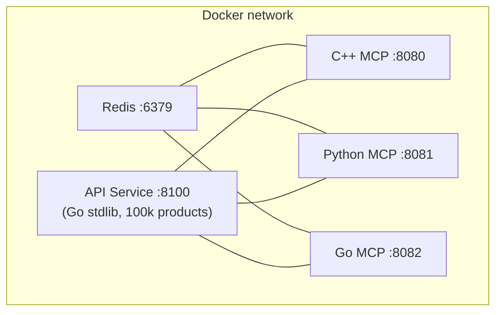
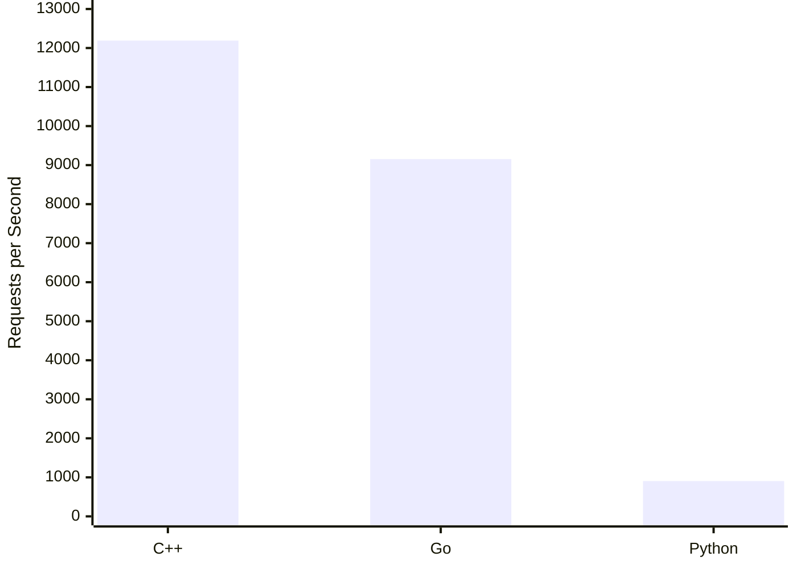

# MCP Benchmark — TM Dev Lab v2

Performance comparison of C++, Python, and Go MCP server implementations under identical I/O-bound workloads (Redis + HTTP).

Methodology mirrors [TM Dev Lab v2](https://github.com/thiagomendes/benchmark-mcp-servers-v2).

---

## Prerequisites

- [Docker](https://docs.docker.com/get-docker/) with Compose v2 (`docker compose`)
- `python3` and `jq` (for orchestration and results parsing)

> k6 runs inside a Docker container (`grafana/k6`) — no host installation needed.

---

## Quick Start

```bash
cd benchmark/

# Benchmark all three servers (builds, seeds Redis, warms up, runs k6)
./run.sh

# Benchmark specific servers
./run.sh cpp
./run.sh cpp python
./run.sh cpp,go
```

`run.sh` handles everything end-to-end:
1. Starts Redis + API service
2. Seeds Redis with 130k keys (carts, history, popularity, rate limits)
3. For each selected server: resets Redis, starts only that server, warms up, runs k6, collects Docker stats
4. Prints a comparison table and saves results to `benchmark/results/<timestamp>/`

Results per server:
- `<server>/k6_summary.json` — full k6 metrics
- `<server>/k6_console.log` — k6 terminal output
- `<server>/stats.json` — CPU/memory/network samples during the test
- `comparison.txt` — side-by-side RPS, latency percentiles, error rates

### Benchmark Profile (TM Dev Lab v2)

- **50 virtual users**, 5-minute sustained load
- 15s ramp-up, 10s ramp-down
- 60s warmup excluded from metrics (5 init sessions + 9 full tool sessions per server)
- Each VU cycles through all three tools + `tools/list`
- Redis FLUSHDB + re-seed between servers

---

## Architecture



Each MCP server exposes the same three tools:

| Tool | Operations |
|---|---|
| `search_products` | Parallel: HTTP product search + Redis `ZREVRANGE` (popularity) |
| `get_user_cart` | Sequential Redis `HGETALL` (cart), then parallel: HTTP product lookup + Redis `LRANGE` (history) |
| `checkout` | All parallel: HTTP cart total + Redis `INCR` (rate limit) + `RPUSH` (history) + `ZADD` (popularity) |

---

## Server Ports

| Service | Port | Notes |
|---|---|---|
| Redis | 6379 | Internal |
| API service | 8100 | Go stdlib, no external deps |
| C++ MCP | 8080 | MCP + `/health` on same port (Streamable HTTP) |
| Python MCP | 8081 | MCP + `/health` on same port |
| Go MCP | 8082 | MCP + `/health` on same port |

> All three servers expose MCP and health endpoints on the same port.

---

## Go Test Client (correctness verification)

Verify tool responses before load testing:

```bash
cd benchmark/client/
go build -o benchmark-client .

# Test a single server
./benchmark-client -url http://localhost:8080/mcp -name cpp

# Compare all three servers
./benchmark-client -compare
```

Output is JSON to stdout (machine-readable) and a summary to stderr.

---

## Manual Operations

### Start individual servers

Redis and API service are always required:

```bash
cd benchmark/

# Just Redis + API + C++
docker compose up redis api-service cpp-server

# Just Redis + API + Python
docker compose up redis api-service python-server

# Just Redis + API + Go
docker compose up redis api-service go-server
```

### Seed Redis manually

```bash
docker compose --profile seeder up redis-seeder
```

### Manual MCP tool call

```bash
# 1. Initialize session (C++ server)
curl -s -X POST http://localhost:8080/mcp \
  -H "Content-Type: application/json" \
  -H "Accept: application/json, text/event-stream" \
  -H "MCP-Protocol-Version: 2025-11-25" \
  -d '{
    "jsonrpc": "2.0",
    "id": 1,
    "method": "initialize",
    "params": {
      "protocolVersion": "2025-11-25",
      "clientInfo": {"name": "test", "version": "1.0"},
      "capabilities": {}
    }
  }'

# 2. Call search_products (use MCP-Session-Id from step 1 response headers)
curl -s -X POST http://localhost:8080/mcp \
  -H "Content-Type: application/json" \
  -H "Accept: application/json, text/event-stream" \
  -H "MCP-Protocol-Version: 2025-11-25" \
  -H "MCP-Session-Id: <session-id-from-step-1>" \
  -d '{
    "jsonrpc": "2.0",
    "id": 2,
    "method": "tools/call",
    "params": {
      "name": "search_products",
      "arguments": {"category": "Electronics", "min_price": 50, "max_price": 500, "limit": 5}
    }
  }'
```

---

## Teardown

```bash
# Stop and remove containers (keeps Redis data if volume was configured)
docker compose down

# Full cleanup including images
docker compose down --rmi all --volumes
```

---

## Troubleshooting

**C++ server build is slow** — the first build compiles the full SDK via Conan inside Docker. Subsequent builds use the Docker layer cache. Expect 3–5 minutes on first run.

**`healthy` never appears for cpp-server** — the healthcheck pings port 8080. If it isn't reachable, the server process likely failed during startup. Check logs:
```bash
docker compose logs cpp-server
```

**Redis seeder exited with error** — ensure Redis is healthy before the seeder runs. If re-seeding, flush Redis first:
```bash
docker compose exec redis redis-cli FLUSHALL
docker compose --profile seeder up redis-seeder
```

**Port conflicts** — if 8080/8081/8082/8100/6379 are in use locally, edit the host-side port mappings in `docker-compose.yml` (left side of `host:container`).

---

## Results

Benchmark run: 50 VUs, 5-minute sustained load, 60s warmup excluded. All three servers achieved **0% error rate**.

### Test Environment

| | |
|---|---|
| **CPU** | AMD Ryzen 9 9900X — 12 cores / 24 threads, 5.66 GHz max boost |
| **RAM** | 32 GB DDR5 |
| **OS** | Ubuntu (kernel 6.17.0-20-generic) |
| **Docker limits** | 2 CPUs, 2 GB RAM per server container |

### Throughput & Latency

| Server | Total Requests | RPS | p50 (ms) | p95 (ms) | p99 (ms) |
|---|---|---|---|---|---|
| **C++** | 3,962,896 | **12,191** | 0.31 | 3.09 | 5.55 |
| **Go** | 2,975,472 | 9,154 | 0.36 | 4.83 | 36.06 |
| **Python** | 293,930 | 904 | 18.17 | 162.41 | 190.20 |

C++ handled **13.5× more requests than Python** and **1.33× more than Go** under identical conditions.

### Per-Tool Average Latency (ms)

| Tool | C++ | Go | Python |
|---|---|---|---|
| `search_products` | 2.65 | 5.82 | 109.4 |
| `get_user_cart` | 2.75 | 3.86 | 162.8 |
| `checkout` | 1.81 | 2.98 | 114.1 |

### Resource Usage (during sustained load)

| Server | CPU (of 2.0 limit) | Memory (steady-state) |
|---|---|---|
| **C++** | ~75% | ~12 MB |
| **Go** | ~200% | ~23 MB |
| **Python** | ~100% | ~60 MB |



### Full Tool Cycle Iterations

Each iteration = `tools/list` → `search_products` → `get_user_cart` → `checkout` (4 HTTP round-trips per cycle).

| Server | Iterations | Iterations/sec |
|---|---|---|
| **C++** | 247,681 | 762 |
| **Go** | 185,967 | 572 |
| **Python** | 29,393 | 90 |

> Raw results are in `benchmark/results/` — each run is timestamped and contains `k6_summary.json`, `stats.json`, and `comparison.txt` per server.
