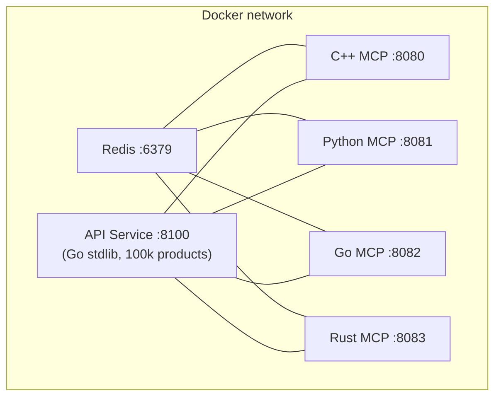

# MCP Benchmark — TM Dev Lab v2

Performance comparison of C++, Python, Go and Rust MCP server implementations under identical I/O-bound workloads (Redis + HTTP).

Methodology mirrors [TM Dev Lab v2](https://github.com/thiagomendes/benchmark-mcp-servers-v2).
The Python, Go, and Rust servers — as well as the API service, Redis seeder, and k6 script — are sourced directly from that upstream repo (pinned to commit `8a9a5f8e`).

---

## Prerequisites

- [Docker](https://docs.docker.com/get-docker/) with Compose v2 (`docker compose`)
- `python3`, `jq`, and `git` (for orchestration, results parsing, and cloning upstream)

> k6 runs inside a Docker container (`grafana/k6`) — no host installation needed.

---

## Quick Start

```bash
cd benchmark/

# Benchmark all four servers (builds, seeds Redis, warms up, runs k6)
./run.sh

# Benchmark specific servers
./run.sh cpp
./run.sh cpp python
./run.sh cpp,go
```

`run.sh` handles everything end-to-end:
1. Clones the upstream benchmark repo (once, pinned to commit `8a9a5f8e`) into `benchmark/benchmark-mcp-servers-v2/`
2. Starts Redis + API service
3. Seeds Redis with 130k keys (carts, history, popularity, rate limits)
4. For each selected server: resets Redis, starts only that server, warms up, runs k6 **3 times**, picks the median run
5. Collects Docker CPU/memory/network stats during the test
6. Prints a comparison table and saves results to `benchmark/results/<timestamp>/`

Results per server:
- `<server>/k6_summary.json` — canonical (median) k6 metrics
- `<server>/k6_summary_run{1,2,3}.json` — raw results from each of the 3 k6 runs
- `<server>/k6_multi_run_stats.json` — per-run RPS and coefficient of variation %
- `<server>/k6_console_run{1,2,3}.log` — k6 terminal output per run
- `<server>/stats.json` — CPU/memory/network samples during the test
- `comparison.txt` — side-by-side RPS, latency percentiles, error rates

### Benchmark Profile (TM Dev Lab v2)

- **50 virtual users**, 5-minute sustained load
- 15s ramp-up, 10s ramp-down
- 60s warmup excluded from metrics (5 init sessions + 9 full tool sessions per server)
- Each VU cycles through all three tools + `tools/list`
- Redis FLUSHDB + re-seed between servers

---

## Architecture


```mermaid
graph TD
    subgraph Docker network
        Redis["Redis :6379"]
        API["API Service :8100<br/>(Go stdlib, 100k products)"]
        CPP["C++ MCP :8080"]
        Python["Python MCP :8081"]
        Go["Go MCP :8082"]
        Rust["Rust MCP :8083"]
    end

    Redis --- CPP
    Redis --- Python
    Redis --- Go
    Redis --- Rust
    API --- CPP
    API --- Python
    API --- Go
    API --- Rust
```

Each MCP server exposes the same three tools:

| Tool | Operations |
|---|---|
| `search_products` | Parallel: HTTP product search + Redis `ZREVRANGE` (popularity) |
| `get_user_cart` | Sequential Redis `HGETALL` (cart), then parallel: HTTP product lookup + Redis `LRANGE` (history) |
| `checkout` | Parallel: HTTP cart total + Redis `INCR` (rate limit), then sequential `RPUSH` + `ZINCRBY` |

---

## Server Ports

| Service | Port | Notes |
|---|---|---|
| Redis | 6379 | Internal |
| API service | 8100 | Go stdlib, no external deps |
| C++ MCP | 8080 | MCP + `/health` on same port (Streamable HTTP) |
| Python MCP | 8081 | MCP + `/health` on same port |
| Go MCP | 8082 | MCP + `/health` on same port |
| Rust MCP | 8083 | MCP + `/health` on same port |

> All four servers expose MCP and health endpoints on the same port.

---

## Go Test Client (correctness verification)

Verify tool responses before load testing:

```bash
cd benchmark/client/
go build -o benchmark-client .

# Test a single server
./benchmark-client -url http://localhost:8080/mcp -name cpp

# Compare all four servers
./benchmark-client -compare
```

Output is JSON to stdout (machine-readable) and a summary to stderr.

---

## Manual Operations

> **Note:** `docker-compose.yml` builds the Python/Go/Rust servers, API service, and Redis seeder from the upstream clone at `benchmark/benchmark-mcp-servers-v2/`. Run `./run.sh` once first to ensure the clone exists, or clone manually:
> ```bash
> git clone https://github.com/thiagomendes/benchmark-mcp-servers-v2.git benchmark/benchmark-mcp-servers-v2
> cd benchmark/benchmark-mcp-servers-v2 && git checkout 8a9a5f8ef505f46b6079072ef4603304ca672e33
> ```

### Start individual servers

Redis and API service are always required:

```bash
cd benchmark/

# Just Redis + API + C++
docker compose up redis api-service cpp-server

# Just Redis + API + Python
docker compose up redis api-service python-server

# Just Redis + API + Go
docker compose up redis api-service go-server

# Just Redis + API + Rust
docker compose up redis api-service rust-server
```

### Seed Redis manually

```bash
docker compose --profile seeder up redis-seeder
```

### Manual MCP tool call

```bash
# 1. Initialize session (C++ server)
curl -s -X POST http://localhost:8080/mcp \
  -H "Content-Type: application/json" \
  -H "Accept: application/json, text/event-stream" \
  -H "MCP-Protocol-Version: 2025-11-25" \
  -d '{
    "jsonrpc": "2.0",
    "id": 1,
    "method": "initialize",
    "params": {
      "protocolVersion": "2025-11-25",
      "clientInfo": {"name": "test", "version": "1.0"},
      "capabilities": {}
    }
  }'

# 2. Call search_products (use MCP-Session-Id from step 1 response headers)
curl -s -X POST http://localhost:8080/mcp \
  -H "Content-Type: application/json" \
  -H "Accept: application/json, text/event-stream" \
  -H "MCP-Protocol-Version: 2025-11-25" \
  -H "MCP-Session-Id: <session-id-from-step-1>" \
  -d '{
    "jsonrpc": "2.0",
    "id": 2,
    "method": "tools/call",
    "params": {
      "name": "search_products",
      "arguments": {"category": "Electronics", "min_price": 50, "max_price": 500, "limit": 5}
    }
  }'
```

---

## Teardown

```bash
# Stop and remove containers (keeps Redis data if volume was configured)
docker compose down

# Full cleanup including images
docker compose down --rmi all --volumes
```

---

## Troubleshooting

**Upstream clone is missing** — if you see build errors like `unable to prepare context: path not found`, the upstream repo hasn't been cloned yet. Run `./run.sh` once to auto-clone it, or clone manually (see [Manual Operations](#manual-operations)).

**C++ server build is slow** — the first build compiles the full SDK via Conan inside Docker. Subsequent builds use the Docker layer cache. Expect 3–5 minutes on first run.

**`healthy` never appears for cpp-server** — the healthcheck pings port 8080. If it isn't reachable, the server process likely failed during startup. Check logs:
```bash
docker compose logs cpp-server
```

**Redis seeder exited with error** — ensure Redis is healthy before the seeder runs. If re-seeding, flush Redis first:
```bash
docker compose exec redis redis-cli FLUSHALL
docker compose --profile seeder up redis-seeder
```

**Port conflicts** — if 8080/8081/8082/8100/6379 are in use locally, edit the host-side port mappings in `docker-compose.yml` (left side of `host:container`).

---

## Results

See [RESULTS.md](RESULTS.md) for the retained benchmark records:

- `20260405_205033`: C++, Go, and Python comparison
- `20260620_220910`: C++ three-run verification

The `20260620_220910` C++ benchmark was run three times by `run.sh cpp`; the median run achieved **7,025.13 RPS** with **0.22% CV**, **0% errors**, **6.92 MB average memory**, and **8.15 MB max memory**.

### Fair Comparison Status

The `20260405_205033` results compare the retained C++, Go, and Python artifacts. The `20260620_220910` results verify the C++ implementation across three runs.

1. **Identical Infrastructure**: All servers use the same upstream API service, Redis seeder, and Docker resource limits.
2. **Methodology Parity**: The k6 benchmark script matches upstream methodology exactly.
3. **Hardware Consistency**: All tests run on the same hardware (AMD Ryzen 9 9900X).
