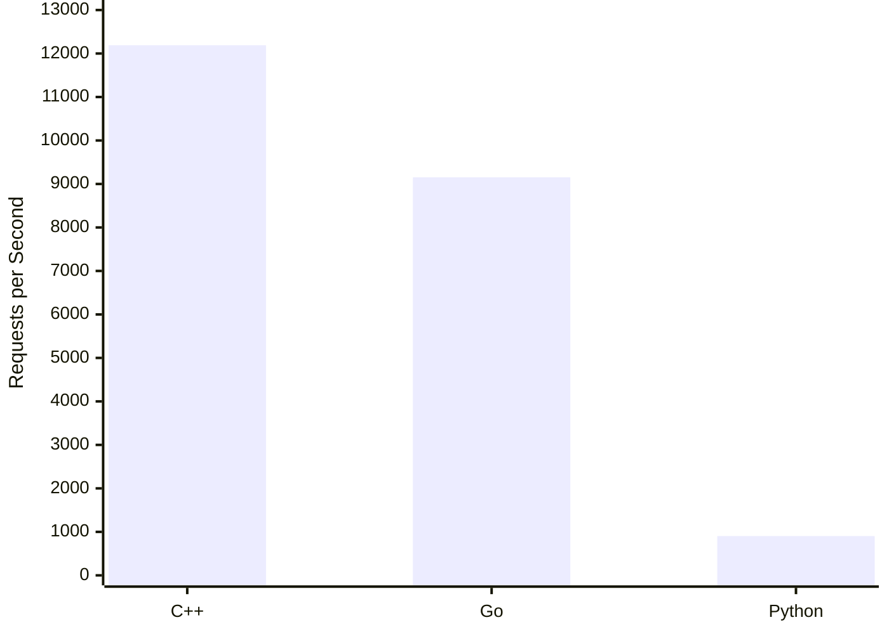

# Benchmark Results

Benchmark run: 50 VUs, 5-minute sustained load, 60s warmup excluded. All three servers achieved **0% error rate**.

## Test Environment

| | |
|---|---|
| **CPU** | AMD Ryzen 9 9900X — 12 cores / 24 threads, 5.66 GHz max boost |
| **RAM** | 32 GB DDR5 |
| **OS** | Ubuntu (kernel 6.17.0-20-generic) |
| **Docker limits** | 2 CPUs, 2 GB RAM per server container |

## Throughput & Latency

| Server | Total Requests | RPS | p50 (ms) | p95 (ms) | p99 (ms) |
|---|---|---|---|---|---|
| **C++** | 3,962,896 | **12,191** | 0.31 | 3.09 | 5.55 |
| **Go** | 2,975,472 | 9,154 | 0.36 | 4.83 | 36.06 |
| **Python** | 293,930 | 904 | 18.17 | 162.41 | 190.20 |

C++ handled **13.5x more requests than Python** and **1.33x more than Go** under identical conditions.

## Per-Tool Average Latency (ms)

| Tool | C++ | Go | Python |
|---|---|---|---|
| `search_products` | 2.65 | 5.82 | 109.4 |
| `get_user_cart` | 2.75 | 3.86 | 162.8 |
| `checkout` | 1.81 | 2.98 | 114.1 |

## Resource Usage (during sustained load)

| Server | CPU (of 2.0 limit) | Memory (steady-state) |
|---|---|---|
| **C++** | ~75% | ~12 MB |
| **Go** | ~200% | ~23 MB |
| **Python** | ~100% | ~60 MB |

## Full Tool Cycle Iterations

Each iteration = `tools/list` → `search_products` → `get_user_cart` → `checkout` (4 HTTP round-trips per cycle).

| Server | Iterations | Iterations/sec |
|---|---|---|
| **C++** | 247,681 | 762 |
| **Go** | 185,967 | 572 |
| **Python** | 29,393 | 90 |

> Raw results are in `benchmark/results/` — each run is timestamped and contains `k6_summary.json`, `stats.json`, and `comparison.txt` per server.
